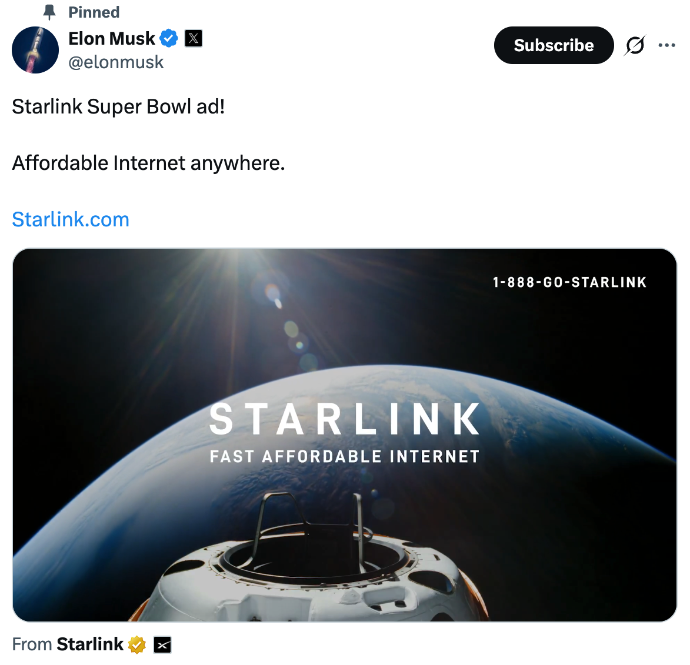
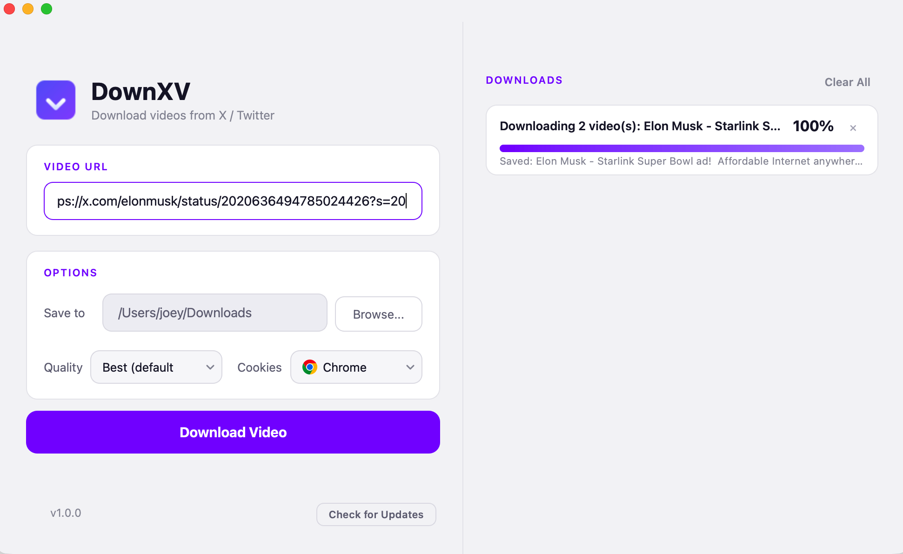
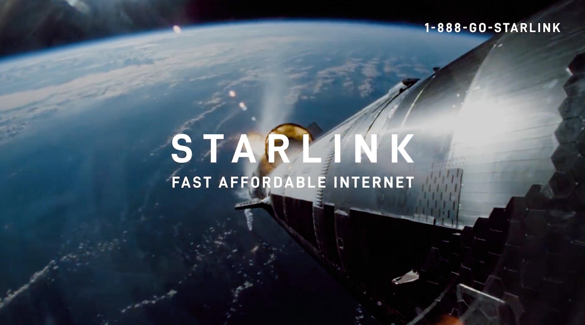

# DownXV

[](https://github.com/zzjoey/DownXV/actions/workflows/release.yml)

[简体中文](README_CN.md)

A free, open-source macOS app to download videos from X (Twitter) posts.

**Auto-fill cookies from your browser. Support multiple videos in one post. No login required for public content.**

| 1. Find a post on X | 2. Paste URL in DownXV | 3. MP4 saved |
| :---: | :---: | :---: |
|  |  |  |

## Features

- **Auto-fill browser cookies** — reads cookies from  Chrome,  Firefox, or  Edge to access authenticated content, no manual export needed
- **Multi-video support** — downloads all videos from posts containing multiple media items
- **Concurrent downloads** — queue up to 3 downloads at once, each with its own progress card
- **Quality selection** — Best, 1080p, 720p, 480p, or audio only
- **Real-time progress** — download speed, ETA, percentage, and file size per task
- **Auto-merge to MP4** — combines video + audio streams into a single MP4 file
- **Click to reveal** — click a completed download card to reveal the file in Finder
- **Safe temp cleanup** — temp files are cleaned up on success, failure, cancel, and window close
- **Native macOS look** — San Francisco system font, transparent titlebar, premium light theme with purple accents

## Getting Started

### Run from source

```bash
git clone https://github.com/zzjoey/DownXV.git
cd DownXV
python3 -m venv .venv
source .venv/bin/activate
pip install -r requirements.txt
python run.py
```

### Build macOS .dmg

```bash
./release.sh
```

The DMG will be at `dist/DownXV-<version>.dmg`. Open it and drag the app to `/Applications` to install.

## How It Works

1. Paste an X/Twitter post URL
2. Choose a save directory, quality, and cookie source
3. Click **Download Video**
4. Videos are saved as MP4 — click the card to reveal in Finder

> Most X videos require authentication. Select your browser as the cookie source — DownXV reads cookies automatically from your logged-in browser session.

## Tech Stack

| Component | Role |
| --- | --- |
| **Python 3.10+** | Runtime |
| **PySide6** | Qt GUI framework |
| **yt-dlp** | Video extraction engine |
| **PyInstaller** | macOS .app packaging |

## Project Structure

```
├── run.py                  # Entry point
├── build.spec              # PyInstaller config
├── release.sh              # Build .app and package .dmg
├── requirements.txt
├── assets/
│   ├── logo.png            # App logo
│   ├── icon-chrome.svg     # Browser icons for cookie picker
│   ├── icon-firefox.svg
│   ├── icon-edge.svg
│   ├── icon-none.svg
│   └── icon-github.svg
└── src/
    ├── app.py              # QApplication bootstrap
    ├── main_window.py      # Main window UI + download task management
    ├── downloader.py       # yt-dlp download thread
    ├── url_validator.py    # X/Twitter URL validation
    ├── styles.py           # QSS stylesheet (light theme)
    └── logo.py             # Logo loader
```

## Contributing

Issues and pull requests are welcome.

## License

MIT
